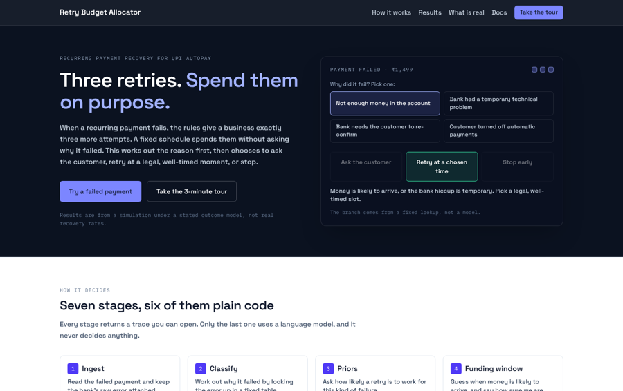
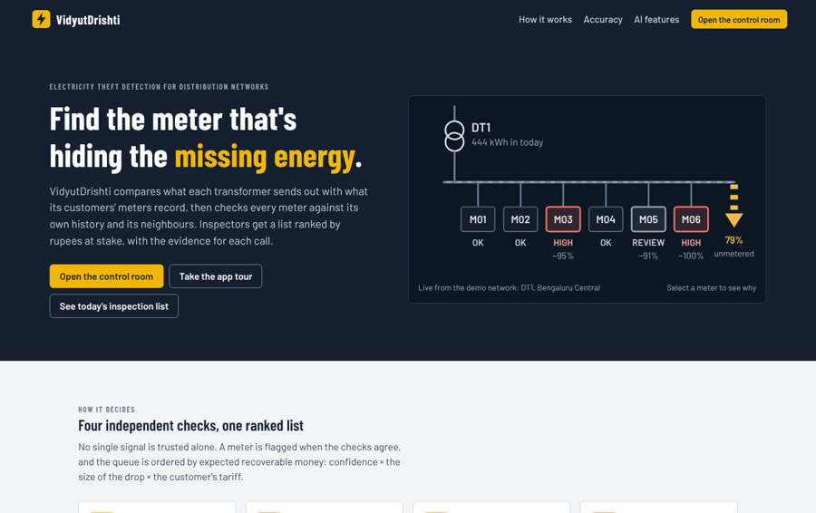
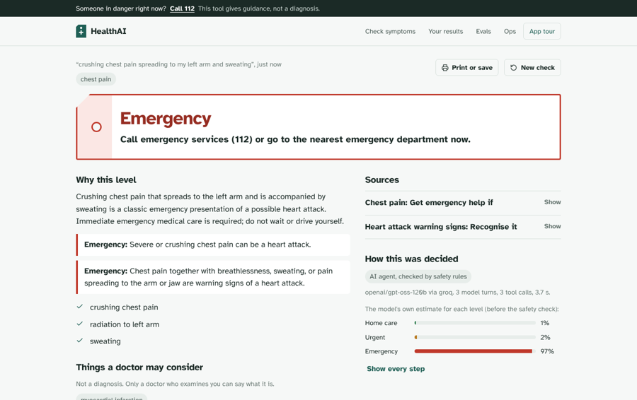
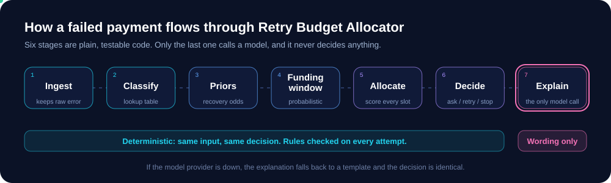

 

**B.Tech CS (AI & ML) · BVRIT Hyderabad · 2023 – 2027 · CGPA 8.80**

 

> **I build AI systems you can check, not just demo.** Every project below is deployed, has a test suite, a published evaluation and an honest write-up of what did not work. Models write the words; plain, tested code makes the decisions that have to be right.

 

## ⚡ By the numbers

Retry Budget Allocator numbers are measured under a stated outcome model on simulated payments, and VidyutDrishti on simulated networks. They show how well a scarce budget is spent, not real-world recovery rates. Each repo's write-up says so.

 

## 🚀 Flagship projects

Each app is live and opens with a built-in guided tour of every page.

<table>
<tr>
<td width="33%" valign="top" align="center">

<h3>Retry Budget Allocator</h3>
<b>Spend 3 retries on purpose</b>  

</td>
<td width="33%" valign="top" align="center">

<h3>VidyutDrishti</h3>
<b>Find the meter hiding the missing energy</b>  

</td>
<td width="33%" valign="top" align="center">

<h3>HealthAI Triage</h3>
<b>An agent that can never downgrade an emergency</b>  

</td>
</tr>
</table>

### 🔁 Retry Budget Allocator
When a UPI AutoPay payment fails, the rules allow only three more tries. This decides how to spend them: **ask the customer, retry at a legal time, or stop early.**
- **50% fewer attempts** than a fixed schedule (70 vs 141), **0 wasted**, **0 rule violations**. It also reports where it loses: 30 vs 35 recoveries, and it only wins on money above Rs 147.82 per attempt.
- Cause, timing and stop are **deterministic and enforced by an AST test**; the model only writes customer wording, with a template fallback.
- Pandera data contract · **mutation testing (31/32 killed)** · 1,200+ property-based cases · CodeQL · CI gates that fail on any violation.

`Python` `FastAPI` `Pydantic` `Pandera` `React` `Tailwind` `mutmut` `Hypothesis` `GitHub Actions`

### ⚡ VidyutDrishti: AT&C Loss Detection
Finds likely electricity theft and metering loss, then ranks inspections by the money they would recover.
- **4 independent checks** (transformer balance, own history, peers, Isolation Forest). On 20 unseen networks: **0.82 precision · 0.93 recall · F1 0.87**, with recall gated in CI.
- Tool-calling **copilot**, inspection-brief agent and smart alerts, on Groq → NVIDIA NIM → rules failover. Every number comes from read-only tools (**0 invented meter ids**).
- An **MCP server** exposes the 8 tools to any MCP client, plus an LLM observability page.
- Simulator checked against **real London smart-meter data** (realism 61% → 84%); forecaster benchmarked on real feeders (MASE 1.52 → 0.83).

`Python` `FastAPI` `scikit-learn` `React` `TypeScript` `TanStack Query` `Groq` `NVIDIA NIM` `MCP`

### 🩺 HealthAI: Triage Agent with Safety Evals
A symptom-triage agent over a RAG knowledge base, built so a model error cannot make an emergency look safe.
- Red-flag rules **can only raise a level**, and the model's free-text advice is ignored in favour of a fixed table with the emergency number.
- **60-case eval gated in CI**: rules alone catch **100% of red-flag cases and 85% of all emergencies**; the 2 misses are published.
- Hybrid retrieval, provider failover, an Ops page logging every model call, and an optional conformal-prediction second opinion (escalate-only) behind an adapter for external decision models (e.g. Jev, Laya). **135 tests** run with no network.

`Python` `FastAPI` `React` `RAG` `Groq` `NVIDIA NIM` `SQLite` `GitHub Actions`

 

## 🧠 How I think about AI systems

1. **Deterministic where it must be right.** Anything about money, safety or rules is plain code with tests.
2. **Models where they add value.** Explaining, summarising and answering, always with a fallback.
3. **Prove it.** Evals, mutation tests, CI gates, and a "what did not work" section.

 

## 🛠️ Toolbox

| | |
|---|---|
| **Languages** | Python · Java · JavaScript · TypeScript · C · SQL |
| **Web & APIs** | FastAPI · Flask · Spring Boot · React · Vite · Tailwind · Next.js · TanStack Query · Pydantic · Pandera · SQLAlchemy |
| **ML / AI** | LLM tool-calling agents · RAG · MCP · conformal prediction · Isolation Forest · scikit-learn · XGBoost · TensorFlow · OpenCV · MediaPipe · Prophet · Chronos |
| **Quality & DevOps** | pytest · Hypothesis · mutmut · ruff · GitHub Actions · CodeQL · Dependabot · OpenSSF Scorecard · Docker · Render · Azure |
| **Data** | PostgreSQL · MySQL · SQLite · ChromaDB · Pandas · NumPy |

 

## 🏆 Recognition & leadership

| | |
|---|---|
| 🥇 **Code by Groww 2026** | Finalist, one of 9 out of 2,900+ registrations (project: [Since](https://github.com/Asha0509/Groww_Hackathon), a smart market watchlist) |
| 🛒 **Flipkart GRiD 8.0** | Round 3 qualifier, top 0.5% of 400,000+ applicants |
| ☀️ **SAP Hackfest 2024** | Semifinalist |
| 💻 **CodeChef 3-Star** | 850+ problems solved across LeetCode, CodeChef and Codeforces |
| 📄 **ICIARD 2024, Thailand** | Presented *Significance of Emergent Technologies in Teaching Learning Processes* |
| 🎓 **Mentorship & leadership programs** | Ananya's Atlassian Mentorship (DSA and backend) · Aspire Leaders Program (Aspire Institute, Harvard-affiliated) |
| 🤖 **A.S.P.I.R.E** | Co-founder and Joint Secretary of BVRIT Hyderabad's first student-led AI/ML club: 9 events, workshops for 100+ students, a 200+ participant inter-college competition |

<b>More projects</b>

- **[A2S – Aesthetics To Spaces](https://github.com/AestheticsToSpaces/A2S_Beta)**: AI interior-design platform. React, Spring Boot and a Python LLM service, 28,000+ products from 7 scrapers, a Gemini multi-agent system, Docker and Azure CI/CD.
- **[NexusDocs](https://github.com/Asha0509/Nexus_Docs)**: RAG document Q&A with source citations. FastAPI, LangChain, ChromaDB, Next.js.
- **[YogaAlign](https://github.com/Asha0509/YogaAlign)**: real-time yoga pose classification, 92% accuracy across 15 poses and 30% lower frame latency (AptPath internship). Flask, OpenCV, MediaPipe.

 

## 📊 GitHub

 

